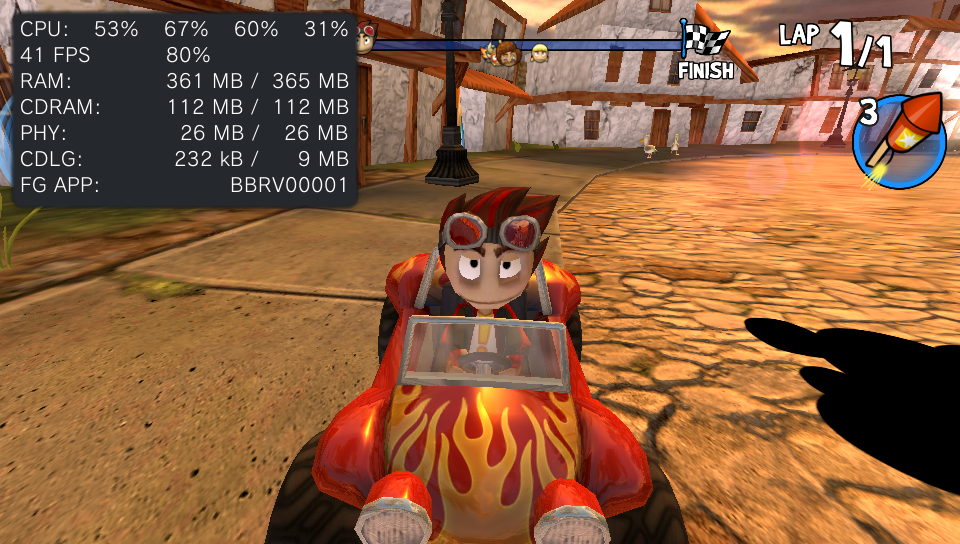
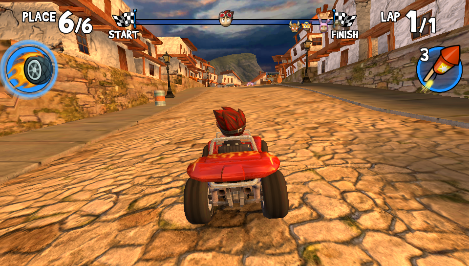
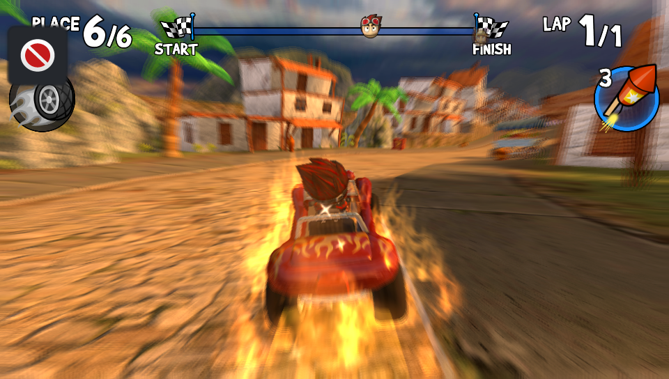
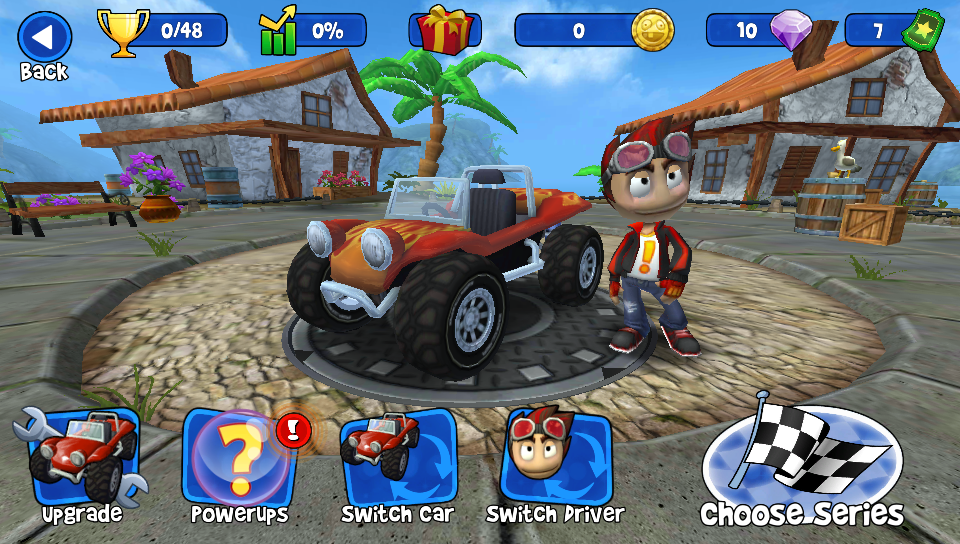
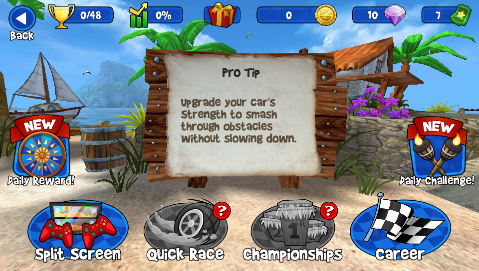
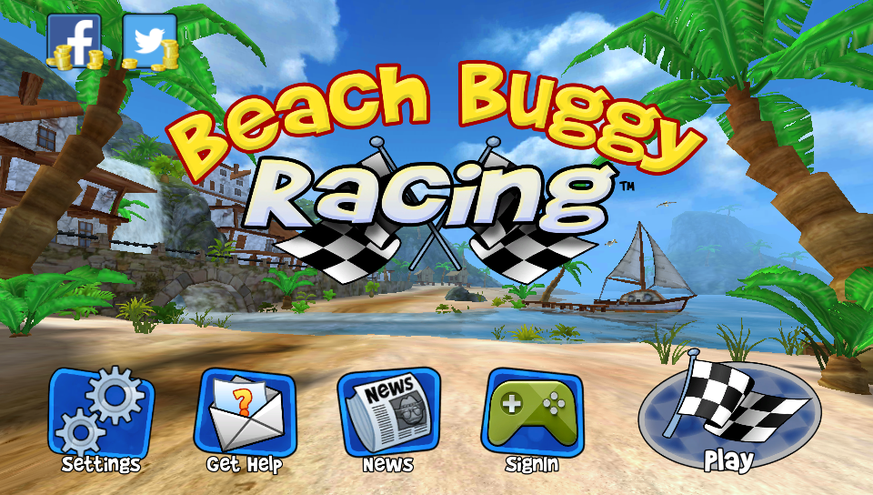

<p align="center">
  
</p>

# Beach Buggy Racing — PS Vita Port

Unofficial wrapper/port of **Beach Buggy Racing** for PlayStation Vita.

The port loads the official Android ARMv7 executable directly into memory, links its dependencies to native Vita functions, and applies the compatibility layer required to run it. In practice, this provides a lightweight Android-like environment in which the original game code can run natively on the PS Vita.

> Port by **MeninoSung**  
> Patcher by **WolffsRoom**

## About the port

This repository is based on the [soloader-boilerplate](https://github.com/v-atamanenko/soloader-boilerplate) by Volodymyr Atamanenko and contributors. The loader provides a tailored, minimal Android-like environment for running the official ARMv7 game executable on PS Vita.

The project uses [VitaGL](https://github.com/rinnegatamante/vitagl), an OpenGL implementation for PlayStation Vita created by Rinnegatamante. The Beach Buggy Racing APK was analyzed with the assistance of artificial intelligence, followed by multiple compilation, testing, and compatibility passes.

_This port does not distribute the game's commercial data. Users must provide their own legally obtained compatible APK; the patcher extracts and verifies the required files._

## Setup Instructions (For End Users)

To install the game correctly, follow these steps:

- Install [kubridge](https://github.com/TheOfficialFloW/kubridge/releases/) and [FdFix](https://github.com/TheOfficialFloW/FdFix/releases/) by copying `kubridge.skprx` and `fd_fix.skprx` to your taiHEN plugins folder (usually `ux0:tai`) and adding these entries to `config.txt` under `*KERNEL`:

  ```text
  *KERNEL
  ux0:tai/kubridge.skprx
  ux0:tai/fd_fix.skprx
  ```

  **Note:** Do not install `fd_fix.skprx` if you are using the rePatch plugin.

- **Optional:** Install [PSVshell](https://github.com/Electry/PSVshell/releases) to overclock your device.
- Install `libshacccg.suprx`, if it is not already installed, by following [this guide](https://samilops2.gitbook.io/vita-troubleshooting-guide/shader-compiler/extract-libshacccg.suprx).
- Legally obtain the supported **Beach Buggy Racing 1.2.22 (126)** APK.

### Supported APK

| Property | Value |
|---|---|
| Game | Beach Buggy Racing |
| Version | 1.2.22 (126) |
| SHA-256 | `0777B6E2961F21EF286A13A475AD1744CAEE7B48F2DDB9574ED0DCE1D1EA8541` |

_The patcher validates the APK size and SHA-256 hash before starting. Other versions are not accepted because their libraries or resources may be incompatible with the port._

### How to Generate the Game Files

1. Open the `Release/Patcher vX.X` folder.
2. Place exactly one compatible APK inside its `APK` folder.
3. Run `BeachBuggyRacingPatcher.exe`.
4. Select the interface language.
5. Review the detected APK and confirm the operation.
6. Wait until verification and generation reach 100%.
7. The patcher will create:

   ```text
   VitaFiles/beachbuggyracing
   ```

The patcher supports English, Brazilian Portuguese, Spanish, French, European Portuguese, Italian, Russian, and Japanese.

### Installation on PS Vita

1. Install `BeachBuggyRacing Vita-vX.X.vpk` using VitaShell or FMVita.
2. Copy the generated `beachbuggyracing` folder to `ux0:data/`.
3. Confirm that the final path is:

   ```text
   ux0:data/beachbuggyracing/
   ```

4. Launch **Beach Buggy Racing** from the LiveArea.

The generated folder contains `libPurple.so`, `libfmod.so`, `libfmodstudio.so`, `assets/Assets.apf`, and `assets/Expansion.apf`.

## Controls

<div align="center">
  <table>
    <thead>
      <tr>
        <th align="center">Control</th>
        <th align="center">Action</th>
      </tr>
    </thead>
    <tbody>
      <tr>
        <td align="center"></td>
        <td align="center">Confirm / use item</td>
      </tr>
      <tr>
        <td align="center"></td>
        <td align="center">Steer</td>
      </tr>
      <tr>
        <td align="center"><strong>R</strong></td>
        <td align="center">Accelerate</td>
      </tr>
      <tr>
        <td align="center"><strong>L</strong></td>
        <td align="center">Brake / reverse</td>
      </tr>
      <tr>
        <td align="center"><strong>START</strong></td>
        <td align="center">Pause</td>
      </tr>
      <tr>
        <td align="center"></td>
        <td align="center">Activate power-up</td>
      </tr>
      <tr>
        <td align="center">Touchscreen</td>
        <td align="center">All interface interactions</td>
      </tr>
    </tbody>
  </table>
</div>

## Performance Notes

- At the maximum graphics preset, the game runs at up to **30 FPS**.
- At the low graphics preset, with some optional settings enabled, the game can maintain a stable **60 FPS**.
- The first loading screen takes longer than subsequent loads.

## Screenshots

<p align="center">
  
  
  
  
  
  
</p>

## Build Instructions (For Developers)

The patcher development environment is located in `Release/Build_Patch`:

- `APK/` contains the reference APK used during development;
- `VitaFiles/beachbuggyracing/` contains the expected final files;
- `patch_data/` contains the extraction manifest;
- `src/` contains the patcher source and PyInstaller specification;
- `Build_Patcher.bat` rebuilds the manifest and/or executable.

To compile the Vita application itself, use [VitaSDK-softfp](https://github.com/vitasdk-softfp) with `VITASDK` configured and the dependencies required by the loader, including VitaGL, VitaShaRK, OpenSLES, and the audio libraries.

```bash
cmake -S . -B build -DCMAKE_BUILD_TYPE=Debug
cmake --build build
```

## Known Issues

- **Tilt controls do not work.** Gyroscope-based steering has not been implemented.
- **Split-screen mode has not been adapted.** Selecting it may display a purchase/payment request inherited from the Android version.
- The first loading screen is slower than normal.

## Legal Notice

This is an unofficial, free, non-commercial port. **Beach Buggy Racing** and all its assets belong to their respective developers and copyright holders.

This repository must not be used to distribute commercial APKs or game data. Use only legally obtained files and support the original developers.

## Credits

The loader is derived from the MIT-licensed `soloader-boilerplate` project by Volodymyr Atamanenko and contributors. FalsoJNI is distributed under its MIT license. Rights to Beach Buggy Racing and its assets belong to their respective owners.

- **Port by MeninoSung**
- **Patcher by WolffsRoom**
- _elliencode_ for the `.so` loader
- [VitaGL by Rinnegatamante](https://github.com/rinnegatamante/vitagl)
- Original game by its respective developers and rights holders

---

## AI Notice

Artificial intelligence tools (Codex ChatGPT) were used to analyze the APK, investigate compatibility issues, and support the iterative compilation and testing process. Full functionality was reached after multiple attempts and adjustments to the port.
